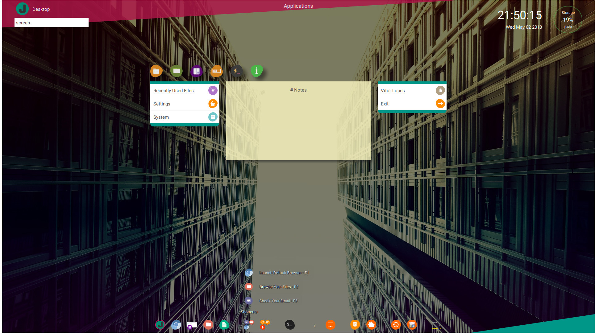
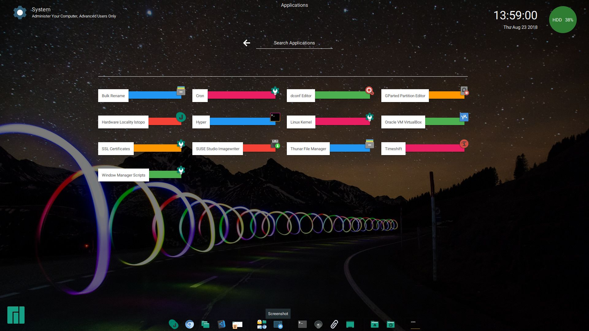

## Just Another Desktop Environment  &nbsp;&nbsp;

Desktop Environment built with Web Technologies for [Manjaro Linux](https://manjaro.org/), watch the video [here](https://www.youtube.com/watch?v=YeNLBA4Cq8w).

Technologies used - Webkit2 engine, Gtk toolkit, HTML, CSS, Javascript, Python.

### Getting Started
* Easy way to try it download [Manjaro WebDad Community Edition](https://sourceforge.net/projects/manjaro-webdad/), run it in a VM or boot it in your pc, the later will give you a better experience, since it uses native hardware acceleration.

* Alternatively Install jade-dashboard from Manjaro repositorys.

* Or clone the repository and run jade-dashboard on your local machine.

#### Prerequisites
* Python 3
* [Jade Application Kit](https://github.com/codesardine/Jade-Application-Kit) - Installing (python3 setup.py install)
* gnome-menus - Gmenu-module
* python-gobject (pygi)
* webkit2gtk

## Contributing

Please read [CONTRIBUTING.md](https://github.com/codesardine/Jadesktop/blob/master/CONTRIBUTING.md) for details on code of conduct, and the process for submitting pull requests.

## Development

* I will be adding more functionality as needed. If you have an idea that you think would work well with JADE, please feel free to open an issue.
* Jade is a fully functional prototype and is subject to changes anytime.
* If there is something you can't find or do inside the interface, open an issue, as I consider UX issues a bug.
* I work on this on my free time, issues may take me a while to resolve.

* Also visit te [Wiki](https://github.com/codesardine/Jadesktop/wiki) for more detailed information. 

## Versioning

[SemVer](http://semver.org/) is used for versioning. For the versions available, see the [tags on this repository](https://github.com/codesardine/Jadesktop/tags). 

## Authors

* **Vitor Lopes** - [Twitter Codesardine](https://twitter.com/codesardine) 

See also the list of [contributors](https://github.com/codesardine/Jadesktop/graphs/contributors) who participated in this project.

## License

* This project is licensed under the GPL3 License - see the [LICENSE.md](LICENSE.md) file for details.
* Background images are under Creative Commons Zero license.

## Acknowledgments

* A Big thanks to the Manjaro team. 
 Muser for designing the WebDad Logo. 
 Contributors. 
 And everyone that uses Jade you are all awesome. 

* Every developer has a vision of what a DE should be, this is mine.
JADE as modern DE does not try to hide things away from the user, and reduces nested clicking for a modern workflow, is not meant to be a full blown DE, and is meant to be complemented by 3rd party applications. 

* Web Technologies - Most ( Non-Technical ) people don't know how to use a computer properly, most don't know what Linux is or that they carry it in their pockets on a daily basis. But they all have one thing in common, they all use the browser to buy, go to social networks or check their email. JADE uses familiar interfaces and technologies, which makes it easy to use no matter the skill level. 

* Inspiration -
built JADE out of my desire to learn Python, and keep my coding skills sharp. I was also in need of an interface for my home entertainment PC, that was easy to use and to hack into. Later on I decided to adapt Jade for desktop use and I decided to release Jade to the masses, maybe someone else will like using it. 
Jade, is named after my wife, but in this case also stands for 'Just Another Desktop Environment'.
 
