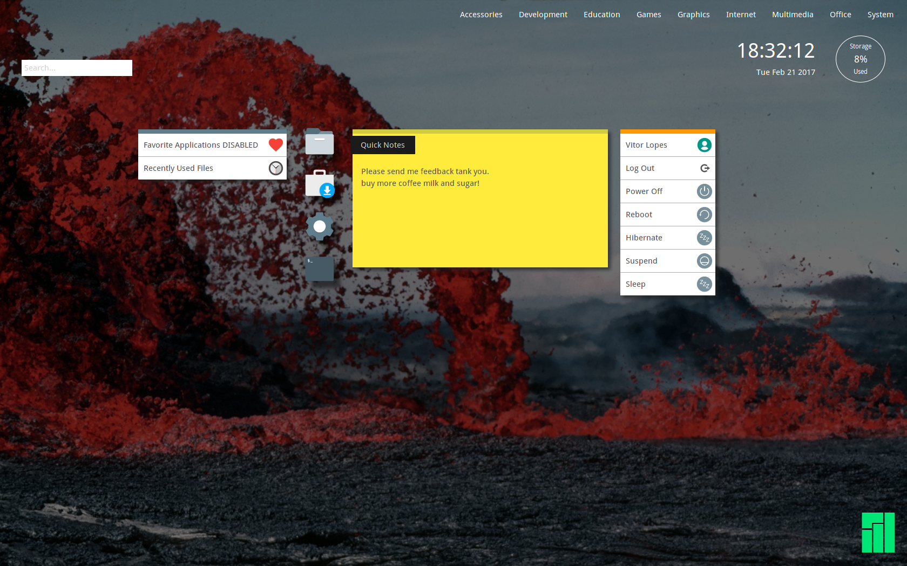

##JADE
JADE a linux desktop built with web techonlogies, HTML5, Javascript, Python, CSS, Gtk, Webkit2.

JADE is not meant to be a full blown DE, and is meant to be complemented by 3rd party applications.

At the moment it only offers basic functionality, runs applications, shuts down your system, allows access to recently used files, provides application search, displays the current time and total disk usage in a pleasant way to the user. 

### Why web techonlogies?
Most ( Non-Technical ) people i know, dont know how to use a computer properly, most dont know what linux is or that they carry it in their pockets in a daily basis. But they all have one thing in common, they all use the browser to buy, go to social networks or check their email.

### Why did i build this?

I built JADE out of my desire of learning python and i was in need of an interface for my living room PC, that was easy to use and hack into.

This is a Protoype desktop, developer build preview, and it is unfinished. JADE is subject to changes at any time and is not ready for daily use, also i dont code for around 20 years so the code might suck balls, that will get improved with time.

you can reach me here:
[Twitter Codesardine](https://twitter.com/codesardine)

or here: https://forum.manjaro.org/t/new-desktop-jade-on-the-works-update-1/17228/40

dependencies: 
* [jade-application-kit](https://github.com/codesardine/Jade-Application-Kit)
* paper-icon-theme-git (aur)
* manjaro-xdg-menu
* python-xdg

[manifest file configuration.](https://github.com/codesardine/Jade-Application-Kit/wiki/Application-manifest-file)

