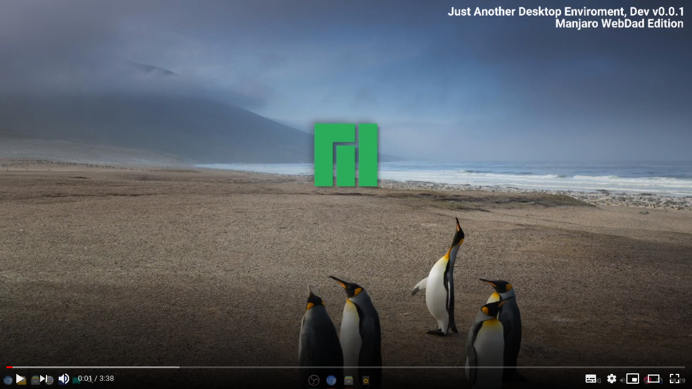

  

## Just Another Desktop Environment  &nbsp;&nbsp;

Desktop Environment built with Web Technologies, JDE takes over your desktop to manage applications a dock or panel is still needed to complement it.

## Acknowledgments
* State Beta
* Small codebase anyone with HTML/CSS skills can change the desktop to look and behave differently.

### Packaging
* Any related packages can be found on [gitlab](https://gitlab.manjaro.org/packages/community/jade).

## Features
* Clean and minimalistic interface
* Settings panel
* Show/Hide application categories
* Keyboard application search
* Visual application search
* Settings panel integrates with individual applications settings
* Dbus integration
* UI inspector
* Animated Backgrounds
* Drag and Drop
* Optional Window auto tile
* Desktop Tour on first run
* Scriptable workspaces

### Manjaro Integration
* Restore factory profile settings
* Settings panel [MSM](https://wiki.manjaro.org/index.php?title=Manjaro_Settings_Manager) integration

### Getting Started
* ISO images TODO

### Prerequisites
* [Menu Data](https://github.com/Manjaro-WebDad/jde-menu-data)
* [JAK](https://github.com/Manjaro-WebDad/jak) 
* Python GObject Introspection 
* Python-Dbus
* Gnome Menu GObject Introspection

## Contributing

Please read [CONTRIBUTING.md](https://github.com/Manjaro-WebDad/jde/blob/master/CONTRIBUTING.md) for details on code of conduct, and the process for submitting pull requests.

## Development
#### Some ideas  
* Entertainment mode
* Plugins support
* Pamac partial integration (partialy done)
* Gamepad integration
* ~Touchscreen integration~
* Voice control (Mycroft)
* Mobile UI support
* File search
* File contents search
* Web search engine integration
* Virtual machines integration
* GTK broadway backend integration 
* Remote desktop

* Also visit the [Wiki](https://github.com/Manjaro-WebDad/jde/wiki) for more detailed information. 

## Versioning

[SemVer](http://semver.org/) is used for versioning. For the versions available, see the [tags on this repository](https://github.com/codesardine/Jadesktop/tags). 

## Authors

* **Vitor Lopes** - [Twitter Codesardine](https://twitter.com/codesardine) 

See also the list of [contributors](https://github.com/Manjaro-WebDad/jde/graphs/contributors) who participated in this project.

## License

* This project is licensed under the GPL License - see the [LICENSE.md](LICENSE.md) file for details.
* Background images are under Creative Commons Zero license.
